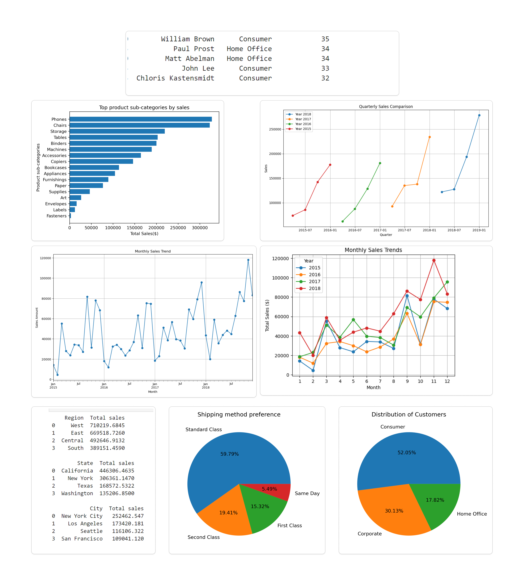

# Superstore Sales Analysis

This project analyzes sales data from a superstore to uncover customer behavior, sales trends, and key insights that help optimize operations and marketing strategies.

## Table of Contents
1. [Objective](#objective)
2. [Key Findings](#key-findings)
3. [Exploratory Data Analysis Insights](#exploratory-data-analysis-insights)
4. [Notable Visualizations](#notable-visualizations)
5. [Challenges and Solutions](#challenges-and-solutions)
6. [Project Conclusion](#project-conclusion)

## Objective
The project aims to analyze superstore sales data, focusing on customer segments, product performance, sales trends, and geographical insights to inform business decisions.

## Key Findings
- **Customer Segments:** Consumers drive the highest sales, making them a crucial target for marketing.
- **Repeat Customers:** Identified loyal customers, suggesting the potential for loyalty programs.
- **Shipping Preferences:** Standard shipping is most popular.
- **Geographical Insights:** The West region generates the highest sales.
- **Product Performance:** Technology products generate the most revenue.

## Exploratory Data Analysis Insights

Key insights from the EDA include customer segmentation, sales patterns, and the identification of repeat and top-spending customers. The analysis helped uncover which products perform best and provided a better understanding of shipping preferences and geographical trends.

### EDA Summary:
- **Customer Segmentation:** Three primary customer segments—Consumer, Corporate, Home Office.
- **Sales by Customer Type:** Consumers contribute the most to total sales.
- **Shipping Mode Preferences:** Standard Class shipping is the most popular.
- **Geographical Insights:** West region performs best in terms of sales.
- **Product Sales:** Technology products lead in revenue.

## Notable Visualizations

Here’s a collage summarizing the key insights from the exploratory data analysis:

  
*Collage of Key Insights from EDA*

This image provides an overview of the significant patterns, trends, and conclusions drawn from the sales data.

## Challenges and Solutions

### Challenges:
- **Missing Postal Codes:** The dataset had missing values in the Postal Code column.
- **Data Type Inconsistencies:** The Postal Code was initially stored as a float.
- **Duplicate Entries:** Ensuring there were no duplicates in the dataset.

### Solutions:
- **Missing Values:** Filled missing postal codes with 0.
- **Data Types:** Converted Postal Code to an integer type.
- **Data Verification:** Ensured no duplicate records were present.

## Project Conclusion

The analysis provided actionable insights that can drive business decisions. Key benefits include improved targeting for marketing campaigns, optimized inventory management, and better resource allocation across regions.
